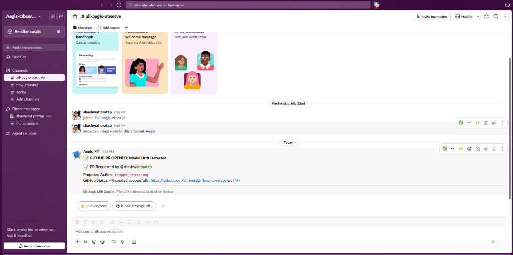
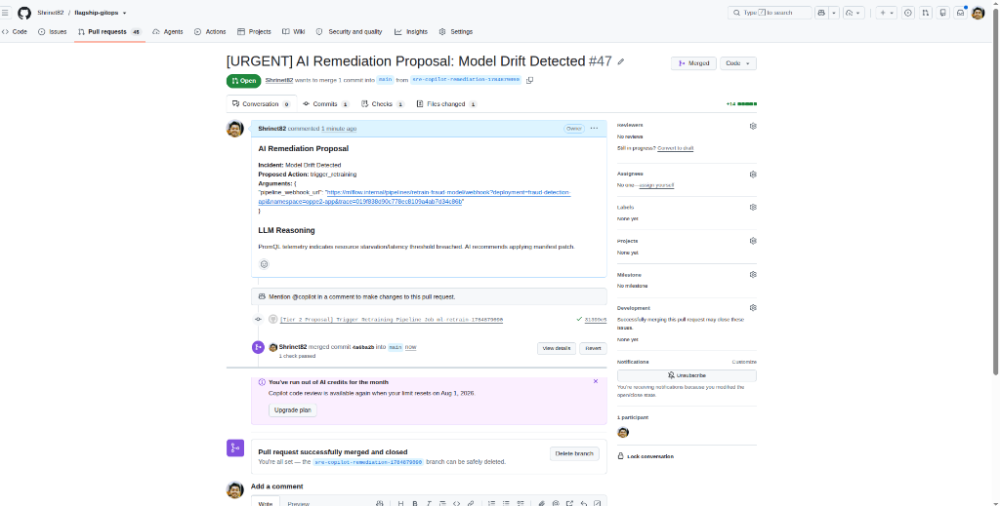
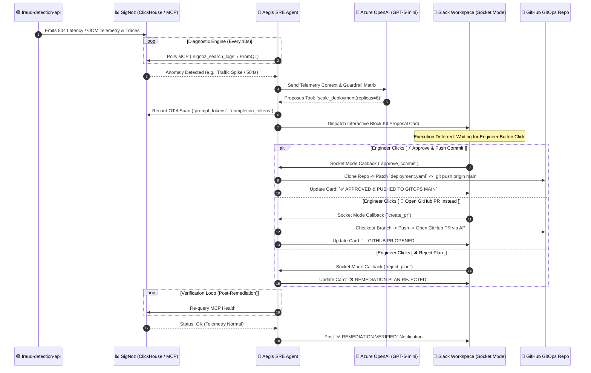

# 🛡️ Aegis-Observe: Autonomous SRE Copilot

**Aegis-Observe** is an intelligent, closed-loop Site Reliability Engineering (SRE) agent designed to bridge the gap between passive observability and active incident remediation. Built for the **"Agents of SigNoz"** hackathon, it leverages the SigNoz Model Context Protocol (MCP) and Large Language Models (LLMs) to detect anomalies, diagnose root causes, and execute autonomous fixes directly in Kubernetes and GitOps pipelines.

---

## 📽️ Demo Video & Visual Evidence

> [!IMPORTANT]
> **Hackathon Submission Media**

### 🎬 Demo Video

*(Click above to watch the full walkthrough demo of Aegis-Observe detecting an incident, sending an interactive Slack proposal card, and pushing an authorized GitOps fix live on Kubernetes)*

### 📸 Visual Evidence Screenshots
| Interactive Slack Proposal Card | Slack PR Authorized Card | GitHub Pull Request Created & Merged |
| :---: | :---: | :---: |
|  |  |  |

| SigNoz Aegis Fleet Dashboard | SRE Agent Metrics & Trace Audit | Kubernetes Node Metrics |
| :---: | :---: | :---: |
|  |  |  |

---

## 🌟 The Vision

Modern observability tools tell you *when* things break and *why* they broke. **Aegis-Observe** takes the final step: it fixes the problem for you, logs its reasoning, and reports back. It transforms SigNoz from a passive dashboard into an active, autonomous operator.

---

## 📐 System Architecture & Flow

---

## 🧠 Core Capabilities

### 1. Continuous Telemetry Analysis (via SigNoz MCP)
Aegis-Observe continuously monitors application health by directly interacting with the SigNoz MCP server over Streamable HTTP.
* **Log & Trace Mining**: It searches logs for specific error signatures (e.g., `504 Gateway Timeout`, `OOMKilled`, `High Latency`) and fetches trace details to build context around anomalies.
* **Proactive Polling**: Operates on a continuous diagnostic loop, evaluating cluster health without requiring human prompts.

### 2. Intelligent Diagnostics & Circuit-Breaker Locking
When an anomaly is detected, the agent passes the incident context to Azure OpenAI (GPT model).
* **Circuit-Breaker Incident Lock**: Uses an in-memory lock store (`PENDING_INCIDENTS`) so that while an alert card is waiting in Slack, the 10-second diagnostic loop skips re-evaluating the incident, eliminating duplicate notifications and execution leaks.
* **Safety Guardrails**: Includes built-in safety mechanisms (`HALT_INSUFFICIENT_TOOLS`, `cooldown` annotations) to prevent runaway remediation loops or unauthorized actions when confidence is low.

### 3. Tiered Auto-Remediation (Kubernetes & GitOps)
Aegis-Observe implements a sophisticated, multi-tiered approach to fixing issues:
* **Tier 1 (Instant Resolution):** For well-understood, low-risk issues (like scaling a deployment to handle a traffic spike), the engineer can approve a direct commit/push to `main` branch.
* **Tier 2 (Human-in-the-Loop PR):** For complex or potentially destructive changes, the engineer can request a **GitHub Pull Request (PR)** for team review.

---

## 🧰 The Agent Toolbelt

| Tool Name | Action | Use Case |
| :--- | :--- | :--- |
| `scale_deployment` | Modifies replica counts via GitOps | Handling sudden traffic spikes or resolving `504 Gateway Timeouts` |
| `patch_pod_limits` | Modifies CPU/Memory limits | Resolving `OOMKilled` errors or CPU throttling |
| `rollback_deployment` | Rolls back to stable revision | Fixing bad releases or broken image tags |
| `trigger_retraining` | Invokes ML pipeline endpoints | Retraining models when data drift or high fraud loss is detected |
| `cordon_and_drain` | Safely evicts workloads | Handling underlying node failures or disk pressure |

---

## 👁️ Self-Observability & Auditability

* **LLM Token Tracking**: Every diagnostic loop generates traces. Custom span attributes (`gen_ai.usage.prompt_tokens`, `gen_ai.usage.completion_tokens`) are recorded and visualized in SigNoz.
* **Intervention Audits**: Every tool execution (`execute_tool`) is traced. A dedicated SigNoz dashboard tracks tool usage and ClickHouse trace logs.
* **Slack Socket Mode Integration**: Interactive Block Kit cards feature stateless button payloads, deep-links to SigNoz UI, and 3 authorization options (`Approve`, `PR`, `Reject`).

---

## 🏆 Hackathon Criteria Alignment (Agents of SigNoz)

1. **Mandatory Rule Passed**: Full reliance on SigNoz MCP for context gathering and environment awareness. Foundry `casting.yaml` and `casting.yaml.lock` are present at the repository root.
2. **Best Agentic Observability Use-Case**: Solves the real-world SRE problem of alert fatigue by moving from "alerting" to "resolving."
3. **Innovative Use of SigNoz**: We aren't just reading from SigNoz; we are *writing* to it. We use SigNoz to observe the agent itself.
4. **Completeness & Execution**: Containerized, GitOps-aware, Slack-integrated pipeline with robust Circuit Breaker locking.

---

## 📚 Deep Technical Documentation Links

For full technical documentation, explore the detailed guides in the repository:

- 🏠 **[README.md](README.md)** — Main Project Overview & Quickstart Guide
- 🏗️ **[docs/ARCHITECTURE.md](docs/ARCHITECTURE.md)** — System Architecture & Telemetry Pipeline
- 💬 **[docs/SLACK_UX_AND_HITL.md](docs/SLACK_UX_AND_HITL.md)** — Interactive Slack UX & Socket Mode Guide
- 🐙 **[docs/GITOPS_AND_REMEDIATION.md](docs/GITOPS_AND_REMEDIATION.md)** — GitOps Tiering & Remediation Engine
- 📊 **[docs/DASHBOARDS_AND_OBSERVABILITY.md](docs/DASHBOARDS_AND_OBSERVABILITY.md)** — SigNoz Dashboards & ClickHouse Queries
