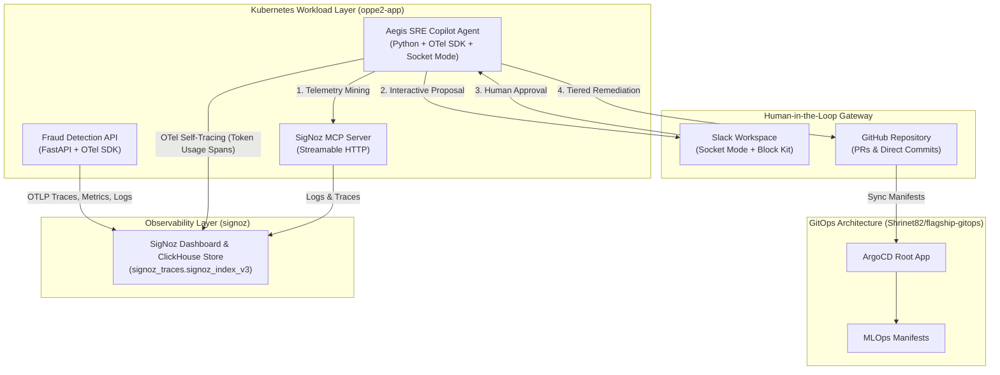

# 🛡️ Aegis-Observe: Autonomous SRE Copilot

[](https://signoz.io)
[](https://opensource.org/licenses/MIT)
[](https://python.org)
[](https://kubernetes.io)
[](https://argoproj.github.io/cd/)

**Aegis-Observe** is an autonomous, self-healing SRE platform designed for enterprise MLOps, built specifically for the **Agents of SigNoz Hackathon (Track 01: AI & Agent Observability)**.

It connects a deterministic LLM-powered SRE agent with application telemetry in real-time using the **SigNoz Model Context Protocol (MCP) Server**. It automatically diagnoses cluster anomalies (memory starvation, traffic spikes, model drift, bad releases) and executes human-authorized remediations through GitOps and Kubernetes APIs.

---

## 📽️ Demo Video & Screenshot Placeholders

> [!IMPORTANT]
> **Submission Demonstration Artifacts**

### 🎬 Live Demo Video
[](https://youtube.com/watch?v=YOUR_VIDEO_ID)
*(Click to watch the full demonstration video showing real-time MCP anomaly detection, Slack interactive authorization, and GitOps remediation)*

### 📸 Visual Interface Evidence
| Interactive Slack Proposal | Slack PR Authorized | GitHub Pull Request Created & Merged |
| :---: | :---: | :---: |
|  |  |  |

| SigNoz Aegis Dashboard | SigNoz SRE Agent Metrics | Kubernetes Node Metrics |
| :---: | :---: | :---: |
|  |  |  |

---

## 🚀 System Architecture Overview



---

## 🧠 Core Capabilities & Feature Matrix

| Feature | Description | File Reference |
| :--- | :--- | :--- |
| **SigNoz MCP Telemetry Mining** | Mines ClickHouse log streams and trace indexes via Streamable HTTP MCP tools. | [mcp_client.py](file:///home/shrinet82/Opensource/SigNoz/sre-copilot/mcp_client.py) |
| **Circuit-Breaker Locking** | `PENDING_INCIDENTS` set locks diagnostic loops while alerts sit in Slack, preventing race conditions. | [agent.py](file:///home/shrinet82/Opensource/SigNoz/sre-copilot/agent.py) |
| **Interactive Slack Gateway** | Slack Block Kit UI with Socket Mode (`Approve`, `PR`, `Reject`) embedding stateless payloads. | [slack_notifier.py](file:///home/shrinet82/Opensource/SigNoz/sre-copilot/slack_notifier.py) |
| **Tiered GitOps Remediation** | Tier 1 instant push to `main` vs Tier 2 GitHub PR creation with LLM reasoning breakdown. | [gitops.py](file:///home/shrinet82/Opensource/SigNoz/sre-copilot/gitops.py) |
| **Node Cordon & Drain** | Direct Kubernetes API node cordoning and eviction for hardware pressure. | [k8s_tools.py](file:///home/shrinet82/Opensource/SigNoz/sre-copilot/k8s_tools.py) |
| **OTel Self-Observability** | Exports agent token consumption (`gen_ai.usage.prompt_tokens`) and tool spans to SigNoz. | [agent.py](file:///home/shrinet82/Opensource/SigNoz/sre-copilot/agent.py) |

---

## 🏆 Hackathon Rules & Reproducibility Compliance

### 1. SigNoz Foundry Requirement (`casting.yaml`)
In accordance with the **Foundry & Reproducibility Check**, `casting.yaml` and `casting.yaml.lock` are located at the **root of the repository**:
* [casting.yaml](file:///home/shrinet82/Opensource/SigNoz/casting.yaml)
* [casting.yaml.lock](file:///home/shrinet82/Opensource/SigNoz/casting.yaml.lock)

To spin up the observability stack via Foundry:
```bash
foundry cast apply
```

### 2. SigNoz MCP Requirement
The agent natively queries SigNoz telemetry using the official **SigNoz MCP Server** endpoint (`http://signoz-mcp.oppe2-app.svc.cluster.local:8000/mcp`) via `signoz_search_logs` and `signoz_get_trace_details`.

### 3. AI Assistance Disclosure
In accordance with the **Agents of SigNoz Hackathon** rules, we explicitly declare that AI coding assistants (including ChatGPT, Claude, and Gemini Antigravity) were utilized during the development of this project for architectural brainstorming, boilerplate generation, unit test creation, and pair programming. All core logic, safety guardrails, MCP server integrations, and telemetry configurations were thoroughly audited, tested, and validated by human developers.

---

## 📖 Complete Technical Documentation

For in-depth architectural guides, configuration details, and query schemas, refer to the technical docs:

* 📋 **[PROJECT_OVERVIEW.md](file:///home/shrinet82/Opensource/SigNoz/PROJECT_OVERVIEW.md)** — Devpost Project Overview & Full Vision
* 🏗️ **[docs/ARCHITECTURE.md](file:///home/shrinet82/Opensource/SigNoz/docs/ARCHITECTURE.md)** — Deep System Architecture & Telemetry Pipeline
* 💬 **[docs/SLACK_UX_AND_HITL.md](file:///home/shrinet82/Opensource/SigNoz/docs/SLACK_UX_AND_HITL.md)** — Interactive Slack UX, Socket Mode & Circuit Breaker Guide
* 🐙 **[docs/GITOPS_AND_REMEDIATION.md](file:///home/shrinet82/Opensource/SigNoz/docs/GITOPS_AND_REMEDIATION.md)** — GitOps Tiering & Kubernetes Remediation Engine
* 📊 **[docs/DASHBOARDS_AND_OBSERVABILITY.md](file:///home/shrinet82/Opensource/SigNoz/docs/DASHBOARDS_AND_OBSERVABILITY.md)** — SigNoz Dashboards & ClickHouse SQL Queries
