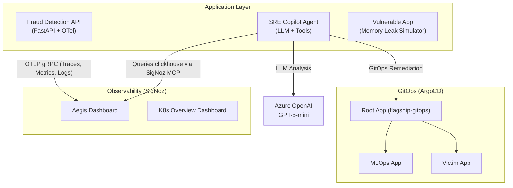

# Aegis-Observe

**Aegis-Observe** is an autonomous, self-healing SRE platform designed for enterprise MLOps, built specifically for the **Agents of SigNoz Hackathon**.

It uses a deterministic LLM-powered agent to observe application telemetry in real-time via the SigNoz MCP (Model Context Protocol) Server, automatically diagnosing incidents (like memory leaks, traffic spikes, or model drift) and proposing or applying remediation actions through GitOps.

## 🚀 Architecture Overview



## 🧠 Core Components

1. **SRE Copilot Agent** (`sre-copilot/`): 
   - A Python-based autonomous agent that queries SigNoz telemetry using the SigNoz MCP server.
   - Traces its own decisions ("Observing the Observer") using OpenTelemetry, capturing token usage and tool invocations.
   - Uses a tiered safety model: safe actions are auto-applied via GitOps, destructive actions open a PR for human review.
   - Enforces a strict `HALT` guardrail for unrecognized incidents.

2. **Fraud Detection API** (`MLOPS-Full-Data-Pipeline/`):
   - A production-ready FastAPI application serving a scikit-learn model.
   - Fully instrumented with OpenTelemetry (Traces, Metrics, and Logs) exporting directly to the SigNoz collector.

3. **GitOps Infrastructure** (`flagship-gitops/`):
   - ArgoCD configuration that manages the deployment of the SRE Copilot and Fraud API.
   - The SRE agent remediates issues by committing fixes directly to this repo, letting ArgoCD handle the deployment.

4. **Victim App Simulator** (`flagship-gitops/manifests/victim-app.yaml`):
   - A vulnerable application that intentionally leaks memory to trigger OOMKilled events and test the SRE Copilot's response.

## 🛠️ Reproducibility (Foundry & SigNoz)

This project relies on **SigNoz** as its core observability backbone. The deployment configuration is fully reproducible.

### 1. Provision Infrastructure
We use DigitalOcean via Terraform (`flagship-infra/`) to spin up a k3s cluster.

### 2. Install SigNoz via Foundry
The project includes a `casting.yaml` and `casting.yaml.lock` in the `flagship-gitops/` directory. 

To deploy SigNoz and the SigNoz MCP Server:
```bash
# Ensure you are in the flagship-gitops directory
cd flagship-gitops
foundry cast apply
```

### 3. Deploy the Apps
Once SigNoz is running, apply the ArgoCD root application to deploy the workloads:
```bash
kubectl apply -f flagship-gitops/root-app.yaml
```

## 📊 Observability Depth

- **Traces**: End-to-end tracing on the ML predictions (`app.py`) AND the SRE Agent (`agent.py`).
- **Metrics**: Standard resource utilization metrics + custom prediction metrics.
- **Logs**: Structured JSON logs (via GCP formatter) exported natively via OpenTelemetry Logs SDK.
- **MCP Server**: The agent natively queries the SigNoz ClickHouse backend via the SigNoz MCP server to fetch real-time telemetry context.
- **Dashboards**: Features the custom **Aegis Dashboard**, providing fleet health metrics, resource saturation, and a live audit stream of the SRE agent's actions.
