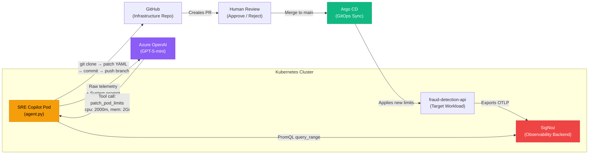

<p align="center">
  <h1 align="center">🛡️ Aegis Observe</h1>
  <p align="center">
    <strong>Autonomous AI SRE Copilot — Observe. Reason. Remediate.</strong>
  </p>
  <p align="center">
    
    
    
    
    
    
  </p>
</p>

---

## 🚨 The Problem

Modern Kubernetes clusters generate thousands of signals per minute — metrics, logs, traces — all streaming into observability dashboards. But **dashboards don't fix things**. When a pod OOMKills at 3 AM, an SRE still has to:

1. Wake up and read the alert.
2. Open SigNoz / Grafana and hunt for the root cause.
3. Mentally correlate metrics, logs, and traces.
4. SSH into the cluster or push a manifest change.
5. Wait, verify, and hope it doesn't break something else.

**This process is slow, error-prone, and doesn't scale.**

## 💡 The Solution

**Aegis Observe** closes the gap between _seeing_ a problem and _fixing_ it. It deploys an autonomous AI agent directly inside your Kubernetes cluster that continuously:

1. **Observes** — Polls the SigNoz PromQL API every 10 seconds for live telemetry (memory usage, CPU saturation, error rates).
2. **Thinks** — Feeds raw time-series data to an LLM (Azure OpenAI) that autonomously diagnoses the incident and selects the correct remediation tool.
3. **Acts** — Executes the fix via GitOps: patching Kubernetes manifests, committing to an infrastructure repo, and creating Pull Requests for human review — all without human intervention.

> **This is not a chatbot. This is not a dashboard plugin. This is a fully autonomous agent that reasons over live telemetry and takes real infrastructure actions.**

---

## 🏗️ Architecture



**The Observe → Think → Act loop runs autonomously, 24/7, inside your cluster.**

---

## ✨ Key Features

| Feature | Description |
|---|---|
| **🔍 Native SigNoz Integration** | Queries the SigNoz `query_range` API directly using PromQL. No scraping hacks, no webhook wrappers. |
| **🧠 LLM-Powered Diagnostics** | Raw telemetry is injected into a constrained system prompt. The LLM autonomously decides _what_ to fix and _how much_ to scale. |
| **🔧 5 Remediation Tools** | `scale_deployment`, `patch_pod_limits`, `rollback_deployment`, `trigger_retraining`, `cordon_and_drain` |
| **🛡️ Tiered Safety Model** | **Tier 1** (safe ops like scaling) auto-push to `main`. **Tier 2** (destructive ops like rollbacks) create a PR for human approval. |
| **🚫 Safety Interlocks** | If the LLM encounters an incident outside its toolset (e.g., expired TLS certs), it outputs `HALT_INSUFFICIENT_TOOLS` and pages a human instead of guessing. |
| **📦 Pure GitOps Execution** | Every remediation is a git commit to a declarative YAML manifest. Argo CD syncs it to the cluster. No imperative `kubectl` commands in production. |

---

## 🚀 Quick Start

### Prerequisites

- A running Kubernetes cluster (K3s, Minikube, or managed)
- [SigNoz](https://signoz.io/docs/install/) deployed in-cluster
- An Azure OpenAI resource with a deployed model
- A GitHub Personal Access Token with repo permissions
- [Argo CD](https://argo-cd.readthedocs.io/) (optional, for full GitOps sync)

### 1. Clone the Repository

```bash
git clone https://github.com/Shrinet82/aegis-observe.git
cd aegis-observe
```

### 2. Create Secrets

Edit `manifests/secrets-template.yaml` with your real credentials, then apply:

```bash
kubectl create namespace oppe2-app    # if it doesn't exist
kubectl apply -f manifests/secrets-template.yaml
```

### 3. Deploy the SRE Copilot

```bash
kubectl create configmap sre-copilot-code \
  --from-file=agent.py=sre-copilot/agent.py \
  --from-file=requirements.txt=sre-copilot/requirements.txt \
  -n oppe2-app

kubectl apply -f manifests/sre-copilot-deployment.yaml
```

### 4. Verify It's Running

```bash
kubectl logs -f -l app=sre-copilot -n oppe2-app
```

You should see:
```
INFO - sre-copilot - Starting Intelligent Remediation Loop...
INFO - sre-copilot - Polling SigNoz API for live telemetry...
INFO - sre-copilot - Sleeping for 10 seconds before next check...
```

### 5. Trigger an Incident

Deploy the target workload and simulate memory starvation:

```bash
kubectl apply -f manifests/fraud-detection-api.yaml

# Crush the memory limit to trigger resource starvation
kubectl patch deploy fraud-detection-api -n oppe2-app \
  -p '{"spec":{"template":{"spec":{"containers":[{"name":"fraud-api-container","resources":{"limits":{"memory":"100Mi"}}}]}}}}'
```

Watch the agent detect the anomaly and generate a Pull Request on your GitHub repo!

> 📖 For detailed step-by-step incident scenarios, see the [Incident Simulation Playbook](docs/INCIDENT_PLAYBOOK.md).

---

## 📁 Repository Structure

```
aegis-observe/
├── README.md                              # You are here
├── LICENSE                                # MIT License
├── .gitignore
│
├── sre-copilot/
│   ├── agent.py                           # The core autonomous SRE agent
│   └── requirements.txt                   # Python dependencies
│
├── mlops-pipeline/                        # The full MLOps fraud-detection pipeline
│   ├── app.py                             # FastAPI inference server
│   ├── train.py                           # Model training script
│   ├── test.py                            # Unit tests
│   ├── data_prep.py                       # Data preprocessing
│   ├── drift_analysis.py                  # Statistical drift detection
│   ├── Dockerfile                         # Container image for the API
│   ├── requirements.txt                   # Python dependencies
│   ├── k8s/                               # Kubernetes manifests for the pipeline
│   ├── drift_reports/                     # Evidential drift analysis reports
│   ├── fairness_plots/                    # ML fairness & bias analysis artifacts
│   └── shap_plots/                        # SHAP explainability visualizations
│
├── manifests/
│   ├── sre-copilot-deployment.yaml        # K8s Deployment for the agent
│   ├── fraud-detection-api.yaml           # Target workload for incident simulation
│   └── secrets-template.yaml              # Template for API keys and tokens
│
├── aegis_dashboard.json                   # SigNoz: Copilot Audit Stream dashboard
├── k8s_overview_dashboard.json            # SigNoz: Kubernetes cluster metrics dashboard
│
└── docs/
    ├── ARCHITECTURE.md                    # System architecture deep dive
    ├── AGENT_WALKTHROUGH.md               # Annotated code walkthrough of agent.py
    ├── SETUP.md                           # Full deployment & setup guide
    └── INCIDENT_PLAYBOOK.md               # Step-by-step incident simulation scenarios
```

---

## 🛠️ Tech Stack

| Component | Technology | Role |
|---|---|---|
| Observability Backend | **SigNoz** (ClickHouse + OTEL) | Collects and stores metrics, traces, and logs |
| Telemetry Protocol | **OpenTelemetry (OTLP)** | Standardized telemetry export from workloads |
| Query Language | **PromQL** | Queries time-series metrics from SigNoz |
| AI / LLM | **Azure OpenAI (GPT-5-mini)** | Autonomous reasoning and tool selection |
| Orchestration | **OpenAI Function Calling** | Structured tool invocation via LLM |
| GitOps Engine | **Argo CD** | Syncs declarative manifests to the cluster |
| Infrastructure | **Kubernetes (K3s)** | Container orchestration |
| Language | **Python 3.11** | Agent runtime |

---

## 🏆 Live Evidence

The SRE Copilot has been tested on a live staging cluster. These are **real Pull Requests** autonomously generated by the AI agent:

| PR | Incident | Status |
|---|---|---|
| [#4 — AI Remediation Proposal](https://github.com/Shrinet82/flagship-gitops/pull/4) | Resource Starvation (OOMKill) | ✅ Merged — Cluster restored |
| [#1 — AI Remediation Proposal: Node Pressure](https://github.com/Shrinet82/flagship-gitops/pull/1) | Node Memory Pressure | 🔄 Open |

---

## 📚 Documentation

| Document | Description |
|---|---|
| [Architecture Deep Dive](docs/ARCHITECTURE.md) | Full system architecture with diagrams |
| [Agent Code Walkthrough](docs/AGENT_WALKTHROUGH.md) | Annotated line-by-line breakdown of `agent.py` |
| [Setup Guide](docs/SETUP.md) | Prerequisites, installation, and configuration |
| [Incident Playbook](docs/INCIDENT_PLAYBOOK.md) | Step-by-step scenarios to test the agent |

---

## 📄 License

This project is licensed under the MIT License — see the [LICENSE](LICENSE) file for details.
