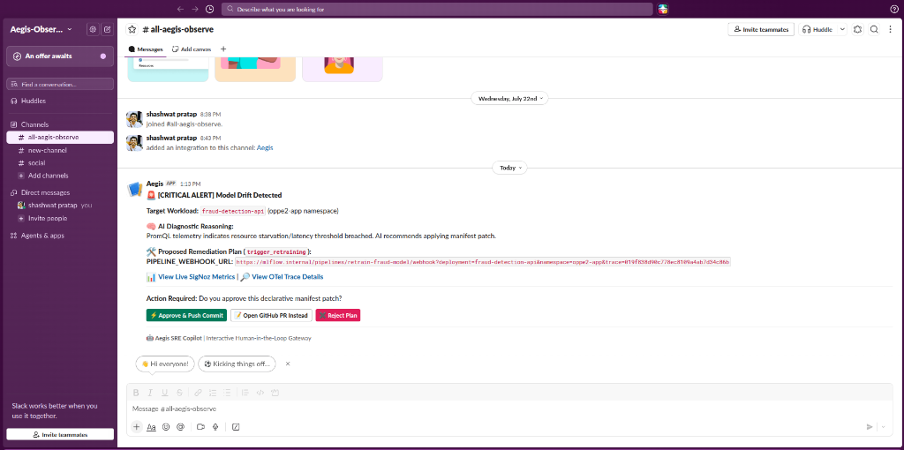

# 🏗️ Aegis-Observe Architecture & Telemetry Pipeline

**Aegis-Observe** is designed as a closed-loop, self-observing SRE Copilot featuring rule-based SigNoz telemetry signal detection, LLM remediation selection, and human-in-the-loop authorization. This document details the end-to-end technical architecture, component interactions, telemetry ingestion pipelines, and self-monitoring implementations.

---

## 📐 System Architecture Diagram

```mermaid
graph TB
    subgraph "Kubernetes Workload Layer (oppe2-app)"
        FRAUD["Fraud Detection API<br/>(FastAPI + OTel SDK)"]
        AGENT["Aegis SRE Copilot Agent<br/>(Python + OTel SDK + Bolt Socket Mode)"]
        MCP["SigNoz MCP Server<br/>(Model Context Protocol)"]
    end

    subgraph "Observability Engine (signoz)"
        COLLECTOR["SigNoz OTLP Ingester<br/>(gRPC :4317)"]
        CLICKHOUSE[(ClickHouse Telemetry Store<br/>signoz_traces.signoz_index_v3)]
        FRONTEND["SigNoz Web UI & Dashboards<br/>(:8080)"]
    end

    subgraph "External Control & GitOps"
        AZURE["Azure OpenAI Service<br/>(GPT-5-mini)"]
        SLACK["Slack Workspace<br/>(Socket Mode & Block Kit)"]
        GITHUB["GitHub GitOps Repo<br/>(Shrinet82/flagship-gitops)"]
    end

    %% Ingestion Flow
    FRAUD -->|"OTLP Traces, Metrics, Logs"| COLLECTOR
    AGENT -->|"OTTel Self-Tracing (Token Usage & Spans)"| COLLECTOR
    COLLECTOR --> CLICKHOUSE
    FRONTEND --> CLICKHOUSE

    %% Agent Intelligence Flow
    AGENT -->|"1. Poll Telemetry via Streamable HTTP"| MCP
    MCP -->|"Fetch Logs & Trace Details"| CLICKHOUSE
    AGENT -->|"2. Diagnostic Guardrails & Reasoning"| AZURE
    AZURE -->> AGENT

    %% Human-in-the-Loop & Remediation Flow
    AGENT -->|"3. Interactive Proposal (Socket Mode)"| SLACK
    SLACK -->|"4. Human Action (Approve / PR / Reject)"| AGENT
    AGENT -->|"5. GitOps Manifest Mutation"| GITHUB
```

---

## 🧩 Core Component Breakdown

### 1. Aegis SRE Copilot Agent (`sre-copilot/agent.py`)
The central intelligence component running as a deployment in the `oppe2-app` namespace.
* **Diagnostic Loop**: Polls telemetry every 10 seconds via the SigNoz MCP server and Kubernetes API.
* **Circuit-Breaker Incident Lock**: Uses an in-memory lock store (`PENDING_INCIDENTS`) to pause diagnostic polling for workloads currently awaiting human decision in Slack.
* **Guardrail Matrix**: Evaluates incident signatures against a strictly enforced decision matrix:
  - **Traffic Spike / Latency (504s)** ➔ `scale_deployment`
  - **Resource Starvation (OOMKilled)** ➔ `patch_pod_limits`
  - **Bad Release (CrashLoopBackOff)** ➔ `rollback_deployment`
  - **Model Drift (Low Confidence)** ➔ `trigger_retraining`
  - **Hardware Pressure (Node DiskPressure)** ➔ `cordon_and_drain`
  - **Unrecognized Anomaly** ➔ Triggers `HALT_INSUFFICIENT_TOOLS` safety stop.

### 2. SigNoz MCP Server Integration (`sre-copilot/mcp_client.py`)
The agent communicates with SigNoz natively using the **Model Context Protocol (MCP)** over Streamable HTTP:
* **`signoz_search_logs`**: Mines ClickHouse log streams for specific error signatures over rolling time windows (5m, 10m).
* **`signoz_get_trace_details`**: Automatically extracts the associated OpenTelemetry `trace_id` from log entries to enrich the incident context with distributed trace details.

### 3. OpenTelemetry Self-Observability ("Observing the Observer")
The agent instruments its own reasoning loops using the OpenTelemetry Python SDK:
* **Tracer Provider**: Configured with `service.name = sre-copilot-agent`.
* **Token Usage Metrics**: Attaches `gen_ai.usage.prompt_tokens` and `gen_ai.usage.completion_tokens` span attributes to every Azure OpenAI call.
* **Tool Invocation Spans**: Wraps `execute_tool()` invocations with trace spans to calculate execution latency and outcome status.

### 4. Interactive Human-in-the-Loop Gateway (`sre-copilot/slack_notifier.py`)
Integrates Slack Bolt with **Socket Mode**:
* Outbound WebSocket connection eliminates the need for public Kubernetes ingresses or exposed HTTP endpoints.
* Stateless payloads are embedded inside Slack button `value` attributes.
* Supports **Approve & Push Commit**, **Open GitHub PR**, and **Reject Plan** actions.

---

## 🖼️ Architecture Screenshots & Visual Evidence

| SigNoz SRE Agent Metrics Dashboard | Interactive Slack Proposal Card |
| :---: | :---: |
|  |  |

---

## 🔗 Related Documentation
- [README.md](../README.md) — Main Project Overview & Quickstart
- [PROJECT_OVERVIEW.md](../PROJECT_OVERVIEW.md) — Feature Deep Dive & Devpost Submission Guide
- [SLACK_UX_AND_HITL.md](SLACK_UX_AND_HITL.md) — Interactive Slack UX & Socket Mode Guide
- [GITOPS_AND_REMEDIATION.md](GITOPS_AND_REMEDIATION.md) — GitOps Tiering & Remediation Engine
- [DASHBOARDS_AND_OBSERVABILITY.md](DASHBOARDS_AND_OBSERVABILITY.md) — SigNoz Dashboards & ClickHouse Query Guide
