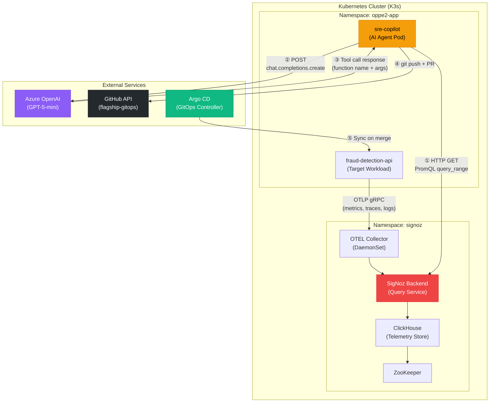
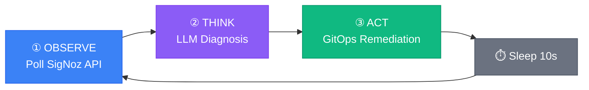
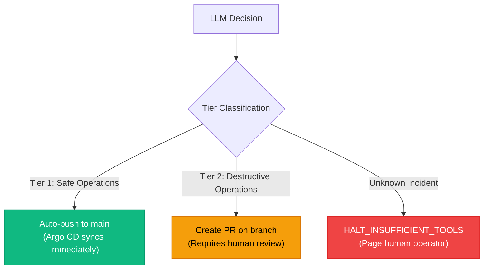

# Architecture Deep Dive

This document provides a comprehensive technical breakdown of the Aegis Observe SRE Copilot system. It is intended for hackathon judges, senior engineers, and anyone evaluating the architectural decisions behind this autonomous remediation agent.

---

## System Architecture Overview



---

## The Observe → Think → Act Loop

The SRE Copilot operates as a continuous daemon inside the Kubernetes cluster. Every 10 seconds, it executes a three-phase autonomous loop:



### Phase 1: Observe — `query_signoz_telemetry()`

The agent constructs a PromQL query and fires an HTTP GET request to the SigNoz `query_range` API endpoint:

```
GET http://signoz.signoz.svc.cluster.local:8080/api/v1/query_range
  ?query=container_memory_usage_bytes{namespace="oppe2-app", pod=~"fraud-detection-api-.*"}
  &start=<now - 300s>
  &end=<now>
  &step=60s
```

This returns a 5-minute sliding window of raw time-series data. If the API returns results, the agent packages them into a structured JSON payload:

```json
{
  "source": "SigNoz_PromQL",
  "metric_data": [
    {
      "metric": {"namespace": "oppe2-app", "pod": "fraud-detection-api-7d98b6c4f-8j2xl"},
      "values": [[1721469600, "958000000"], [1721469660, "990500000"], [1721469720, "1028300000"]]
    }
  ],
  "cluster_namespace": "oppe2-app"
}
```

The agent does **not** pre-interpret this data. It passes the raw bytes to the LLM for diagnosis.

### Phase 2: Think — `run_agent_workflow()`

The raw telemetry payload is injected into a strictly constrained system prompt and sent to the Azure OpenAI API:

```python
messages = [
    {"role": "system", "content": "<system prompt with strict directives>"},
    {"role": "user", "content": f"Analyze this live SigNoz incident data: {telemetry_context}"}
]
```

The LLM is provided with a **tool schema registry** containing 5 functions. Using OpenAI's function calling mechanism (`tool_choice: "auto"`), the model autonomously decides:

1. **Is there an incident?** If metrics are stable → output `HALT`, invoke no tools.
2. **What type of incident?** Memory spike, traffic spike, bad release, etc.
3. **What tool to invoke?** Select from the 5 registered tools.
4. **What arguments to pass?** Calculate the new CPU/memory limits, replica count, etc.

The LLM does all of this reasoning internally — the agent code does not contain any `if memory > threshold` logic.

### Phase 3: Act — `execute_tool()`

When the LLM returns a tool call, the agent translates it into a GitOps action:

1. Clone the infrastructure repository (`flagship-gitops`).
2. Patch the declarative Kubernetes manifest using regex substitution.
3. Commit the change with a descriptive message.
4. Push to GitHub (directly to `main` for Tier 1, or to a branch + PR for Tier 2).

---

## Tiered Remediation Model

Not all remediations are equally safe. The agent enforces a two-tier safety model:



| Tier | Actions | Behavior | Rationale |
|---|---|---|---|
| **Tier 1** | `scale_deployment` | Auto-push to `main` | Scaling replicas is non-destructive and immediately reversible |
| **Tier 2** | `patch_pod_limits`, `rollback_deployment`, `trigger_retraining`, `cordon_and_drain` | Create a PR for human review | These actions modify resource boundaries or roll back releases — they need a human in the loop |

### Pull Request Anatomy

Every Tier 2 PR includes:

- **Title**: `[URGENT] AI Remediation Proposal: <Incident Type>`
- **Incident Type**: Extracted from the telemetry context
- **Proposed Action**: The tool name and computed arguments
- **LLM Reasoning**: The model's natural-language explanation of why it chose this action

This gives the human reviewer full context to make an informed approve/reject decision.

---

## Safety Interlocks

### The HALT Guardrail

If the LLM encounters an incident signature that does not match any of its 5 tools (e.g., expired TLS certificates, database connection pool exhaustion, storage volume corruption), it is instructed to:

1. **NOT** invoke any tool.
2. **NOT** attempt a partial fix.
3. Output a response containing `HALT_INSUFFICIENT_TOOLS` with an explanation of the unserviceable error.

The agent detects this keyword in the LLM response and triggers an escalation path (currently a log warning; extendable to Slack/PagerDuty webhooks).

```
🚨 [PHASE 2 GUARDRAIL BREACHED] - Agent lacks the necessary tools to safely cure this incident.
```

This prevents the agent from "hallucinating" a fix for an incident it doesn't understand.

---

## Tool Definition Registry

The agent exposes 5 tools to the LLM via the OpenAI function calling schema:

| Tool | Trigger Condition | Action |
|---|---|---|
| `scale_deployment` | Traffic spike / high QPS | Increases replica count horizontally |
| `patch_pod_limits` | OOMKilled / memory > 95% of limit | Increases CPU and memory ceilings |
| `rollback_deployment` | CrashLoopBackOff / bad image tag | Reverts to the previous stable revision |
| `trigger_retraining` | ML model drift (confidence < 60%) | Fires an MLflow retraining pipeline webhook |
| `cordon_and_drain` | Node DiskPressure / MemoryPressure | Cordons the node and evicts pods |

Each tool is defined as a JSON schema with typed parameters, descriptions, and required fields. The LLM uses these schemas to generate structured, validated function calls.

---

## Data Flow Summary

```
┌─────────────────────────────────────────────────────────────────┐
│                        Every 10 Seconds                         │
├─────────────────────────────────────────────────────────────────┤
│                                                                 │
│  1. agent.py → HTTP GET → SigNoz query_range API                │
│     "Give me 5 min of container_memory_usage_bytes"             │
│                                                                 │
│  2. SigNoz → Returns raw time-series JSON                       │
│     [{metric: {...}, values: [[ts, bytes], ...]}]               │
│                                                                 │
│  3. agent.py → POST → Azure OpenAI chat.completions.create      │
│     System prompt + raw telemetry + tool schemas                │
│                                                                 │
│  4. Azure OpenAI → Returns tool_call decision                   │
│     {name: "patch_pod_limits", args: {cpu: "2000m", mem: "2Gi"}}│
│                                                                 │
│  5. agent.py → git clone → regex patch YAML → git commit        │
│                                                                 │
│  6a. [Tier 1] → git push main → Argo CD syncs → Healed          │
│                                                                 │
│  6b. [Tier 2] → git push branch → Create PR                     │
│                 Human Reviews → Merge → Argo CD syncs → Healed  │
│                                                                 │
└─────────────────────────────────────────────────────────────────┘
```
