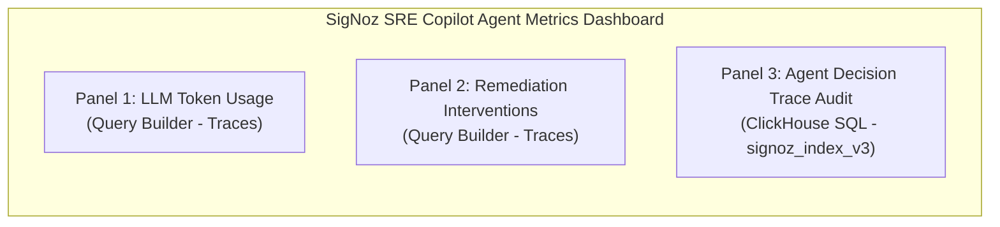

# 📊 SigNoz Dashboards & Self-Observability Guide

**Aegis-Observe** exposes its operational telemetry back into SigNoz using custom dashboards, OpenTelemetry metrics, and ClickHouse trace queries.

---

## 📈 Dashboard Overview (`sre_agent_dashboard.json`)

The dashboard contains three primary panels:



### 1. Panel 1: LLM Token Usage (Prompt & Completion)
- **Data Source**: Traces (`gen_ai.usage.prompt_tokens`, `gen_ai.usage.completion_tokens`)
- **Filter**: `serviceName = sre-copilot-agent`
- **Visualization**: Spline graph showing real-time token consumption over time for LLM reasoning spans.

### 2. Panel 2: Agent Remediation Interventions
- **Data Source**: Traces (`name = execute_tool`)
- **Group By**: `tool.name` (`scale_deployment`, `patch_pod_limits`, `rollback_deployment`, `trigger_retraining`, `cordon_and_drain`)
- **Visualization**: Graph showing intervention frequency by tool type.

### 3. Panel 3: SRE Agent Decision Trace Audit
- **Data Source**: ClickHouse SQL query on `signoz_traces.signoz_index_v3`
- **Query**:
  ```sql
  SELECT 
      timestamp, 
      name AS span_name, 
      duration_nano / 1000000 AS duration_ms, 
      attributes_string['tool.name'] AS executed_tool, 
      attributes_string['incident.context'] AS incident_context 
  FROM signoz_traces.signoz_index_v3 
  WHERE serviceName = 'sre-copilot-agent' 
  ORDER BY timestamp DESC 
  LIMIT 50
  ```
- **Visualization**: Table of the 50 most recent agent reasoning and execution spans.

---

## 🖼️ Live SigNoz Dashboard Screenshots

| SRE Agent Metrics Dashboard | Aegis Fleet Health & Audit Stream |
| :---: | :---: |
|  |  |

| Kubernetes Node Metrics | Kubernetes Workloads Overview |
| :---: | :---: |
|  |  |

---

## 🔗 Related Documentation
- [README.md](../README.md) — Main Project Overview & Quickstart
- [ARCHITECTURE.md](ARCHITECTURE.md) — System Architecture
- [SLACK_UX_AND_HITL.md](SLACK_UX_AND_HITL.md) — Interactive Slack UX
- [GITOPS_AND_REMEDIATION.md](GITOPS_AND_REMEDIATION.md) — GitOps Tiering
