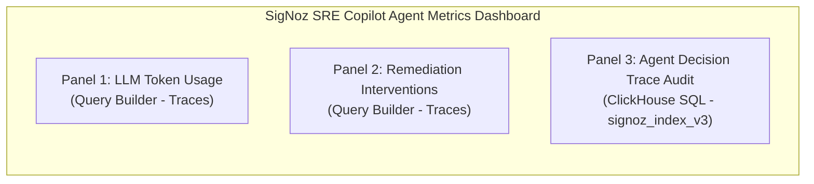
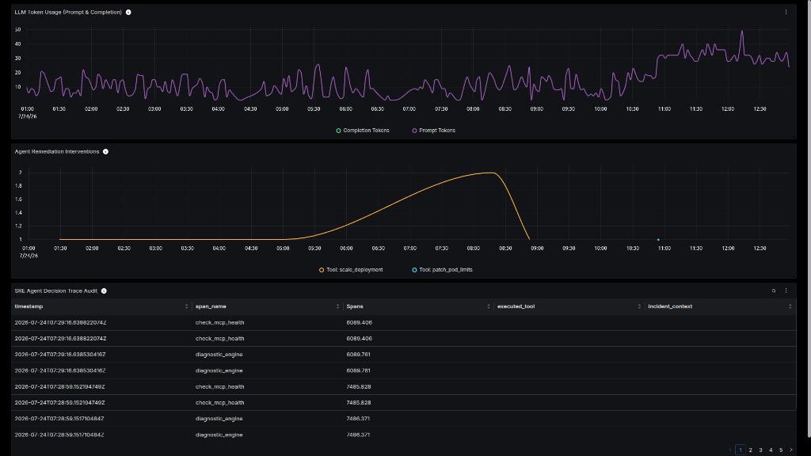
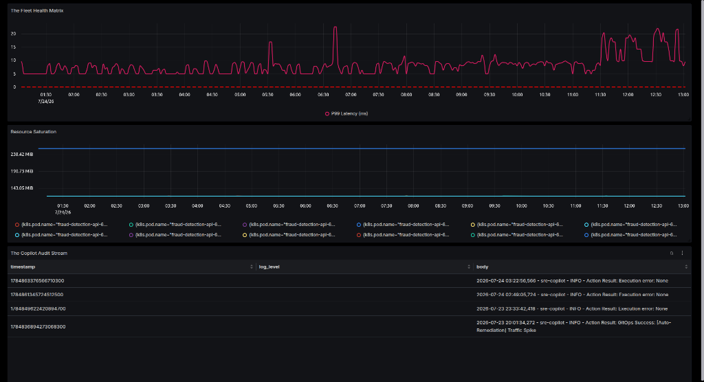
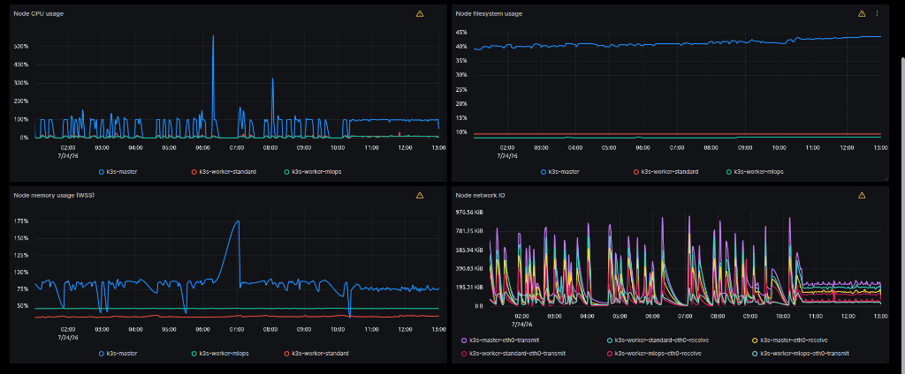
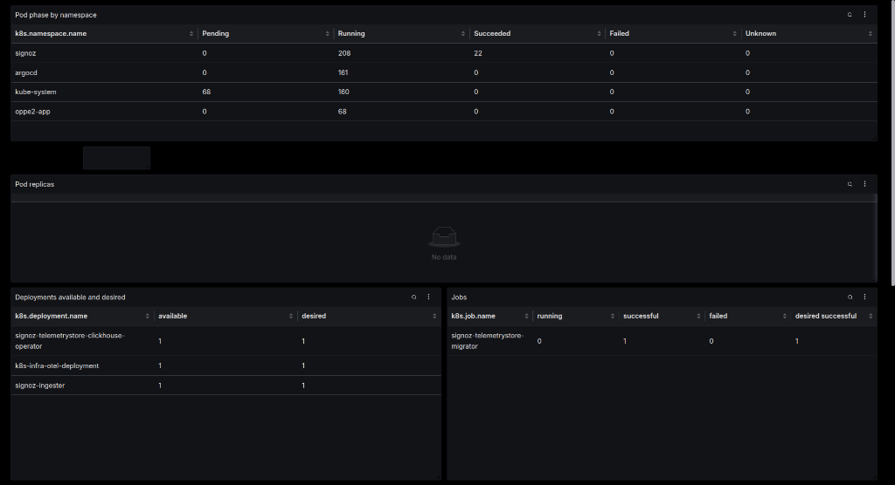

# 📊 SigNoz Dashboards, Observability & Alerting Guide

**Aegis-Observe** exposes its operational telemetry back into SigNoz across all **5 Pillars of Observability**: Traces, Metrics, Logs, Dashboards, and **Alert Rules**.

---

## 🔔 SigNoz Alert Rules Suite (`alerts/`)

To provide proactive guardrails for both the AI agent and application workloads, Aegis-Observe includes automated SigNoz Alert Rules in the `alerts/` directory:

### 1. LLM Token Usage Runaway Guardrail — `sre-copilot-agent`
* **Rule File**: [`alerts/llm_token_usage.json`](../alerts/llm_token_usage.json)
* **Alert Type**: `TRACES_BASED_ALERT`
* **Target Metric**: Cumulative sum of `gen_ai.usage.prompt_tokens` span attribute for `serviceName = 'sre-copilot-agent'`.
* **Evaluation Window**: 10 minutes (`10m`), checked every 1 minute (`1m`).
* **Threshold**: Fire when SUM > `50000` tokens / 10m *(Marked for tuning via `target` constant)*.
* **Severity**: `warning` | **Team**: `ai-sre` | **Category**: `cost-guardrail`
* **Rationale**: Serves as a crucial cost and reasoning-loop guardrail for the autonomous agent itself, preventing runaway LLM queries or infinite tool execution loops.

### 2. Fraud API 504 Error Surge — `fraud-detection-api`
* **Rule File**: [`alerts/fraud_api_504.json`](../alerts/fraud_api_504.json)
* **Alert Type**: `LOGS_BASED_ALERT`
* **Target Metric**: COUNT of log entries with `body` containing `"504"` for `resource.k8s.deployment.name = 'fraud-detection-api'`.
* **Evaluation Window**: 5 minutes (`5m`), checked every 1 minute (`1m`).
* **Threshold**: Fire when COUNT > `5` errors in 5m *(Marked for tuning via `target` constant)*.
* **Severity**: `critical` | **Team**: `sre` | **Service**: `fraud-detection-api`
* **Rationale**: Detects severe application SLO breaches caused by ingress or upstream service timeouts under high traffic load.

---

## 🛠️ How to Import & Export Alert Rules

### Option A: Automated CLI Import (Recommended)
Run the provided helper script with optional environment credentials:
```bash
# Set your SigNoz API URL & API Key (if authentication enabled)
export SIGNOZ_API_URL="http://localhost:8080"
export SIGNOZ_API_KEY="your-signoz-api-key"

# Apply all JSON rules to SigNoz
./alerts/apply_alerts.sh
```

### Option B: Export Existing Rules via API
To export all configured alert rules back into JSON:
```bash
./alerts/export_alerts.sh > alerts/exported_rules.json
```

### Option C: Manual Import via SigNoz UI
1. Open SigNoz UI at `http://localhost:8080` and navigate to **Alerts** ➔ **New Alert**.
2. **For Token Runaway Alert**: Select **Traces**, Filter `serviceName = sre-copilot-agent`, Aggregate `SUM(gen_ai.usage.prompt_tokens)`, set window to `10m` and condition `> 50000`.
3. **For 504 Error Surge Alert**: Select **Logs**, Filter `resource.k8s.deployment.name = fraud-detection-api`, Filter `body CONTAINS 504`, set window to `5m` and condition `> 5`.
4. Click **Save Rule**.

---

## 🖼️ Alert Screenshots & Visual Evidence

> [!NOTE]
> *Placeholders for screenshots of configured & triggered SigNoz alerts.*

| LLM Token Usage Runaway Alert | Fraud API 504 Error Surge Alert |
| :---: | :---: |
|  |  |

---

## 📈 Dashboard Overview (`sre_agent_dashboard.json`)

The dashboard contains three primary panels:



### 1. Panel 1: LLM Token Usage (Prompt & Completion)
- **Data Source**: Traces (`gen_ai.usage.prompt_tokens`, `gen_ai.usage.completion_tokens`)
- **Filter**: `serviceName = sre-copilot-agent`
- **Visualization**: Spline graph showing real-time token consumption over time for LLM reasoning spans.

### 2. Panel 2: Agent Remediation Interventions
- **Data Source**: Traces (`name = execute_tool`)
- **Group By**: `tool.name` (`scale_deployment`, `patch_pod_limits`, `rollback_deployment`, `trigger_retraining`, `cordon_and_drain`)
- **Visualization**: Graph showing intervention frequency by tool type.

### 3. Panel 3: SRE Agent Decision Trace Audit
- **Data Source**: ClickHouse SQL query on `signoz_traces.signoz_index_v3`
- **Query**:
  ```sql
  SELECT 
      timestamp, 
      name AS span_name, 
      duration_nano / 1000000 AS duration_ms, 
      attributes_string['tool.name'] AS executed_tool, 
      attributes_string['incident.context'] AS incident_context 
  FROM signoz_traces.signoz_index_v3 
  WHERE serviceName = 'sre-copilot-agent' 
  ORDER BY timestamp DESC 
  LIMIT 50
  ```
- **Visualization**: Table of the 50 most recent agent reasoning and execution spans.

---

## 🖼️ Live SigNoz Dashboard Screenshots

| SRE Agent Metrics Dashboard | Aegis Fleet Health & Audit Stream |
| :---: | :---: |
|  |  |

| Kubernetes Node Metrics | Kubernetes Workloads Overview |
| :---: | :---: |
|  |  |

---

## 🔗 Related Documentation
- [README.md](../README.md) — Main Project Overview & Quickstart
- [ARCHITECTURE.md](ARCHITECTURE.md) — System Architecture
- [SLACK_UX_AND_HITL.md](SLACK_UX_AND_HITL.md) — Interactive Slack UX
- [GITOPS_AND_REMEDIATION.md](GITOPS_AND_REMEDIATION.md) — GitOps Tiering
