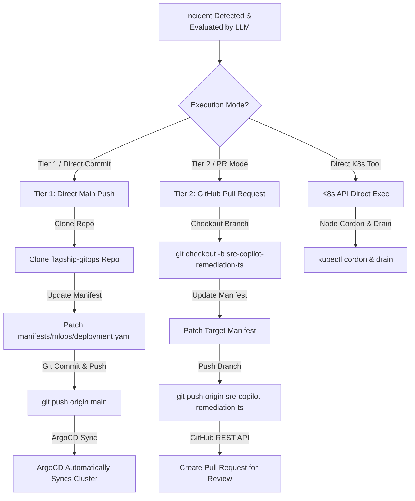

# 🐙 GitOps Engine & Tiered Remediation Strategy

**Aegis-Observe** enforces a two-tier remediation model to ensure declarative infrastructure management, auditable version control, and human oversight.

---

## 🏛️ Tiered Remediation Overview

---

## 🛡️ Remediation Tools & Execution Matrix

| Tool Name | Scope | Default Strategy | Trigger Conditions |
| :--- | :--- | :--- | :--- |
| `scale_deployment` | GitOps Manifest | Tier 1 (or PR override) | Traffic Spikes, 504 Gateway Timeouts, High Inference Latency |
| `patch_pod_limits` | GitOps Manifest | Tier 1 (or PR override) | Container Memory Starvation, OOMKilled events, CPU Throttling |
| `rollback_deployment` | GitOps Manifest | Tier 2 (PR Draft) | CrashLoopBackOff, ImagePullBackOff, Post-release error spikes |
| `trigger_retraining` | GitOps Job | Tier 2 (PR Draft) | ML Prediction Drift, Confidence metrics falling below 60% |
| `cordon_and_drain` | Direct K8s API | Direct Execution | Node DiskPressure, Hardware MemoryPressure |

---

## ⏱️ Cooldown & Safety Annotations

To prevent duplicate remediations or flapping:
* **Cooldown Period**: A 300-second (5-minute) cooldown is enforced per incident signature.
* **Kubernetes Annotations**: Cooldown timestamps are persisted directly as annotations on target deployment objects (`remediation.aegis.io/last-remediated`).

---

## 🖼️ Live GitHub Pull Request & GitOps Evidence

| GitHub Pull Request Created by Agent (#47) | GitHub Pull Request Merged into Main |
| :---: | :---: |
|  |  |

---

## 🔗 Related Documentation
- [README.md](file:///home/shrinet82/Opensource/SigNoz/README.md) — Main Project Overview & Quickstart
- [ARCHITECTURE.md](file:///home/shrinet82/Opensource/SigNoz/docs/ARCHITECTURE.md) — System Architecture
- [SLACK_UX_AND_HITL.md](file:///home/shrinet82/Opensource/SigNoz/docs/SLACK_UX_AND_HITL.md) — Interactive Slack UX & Circuit Breaker
- [DASHBOARDS_AND_OBSERVABILITY.md](file:///home/shrinet82/Opensource/SigNoz/docs/DASHBOARDS_AND_OBSERVABILITY.md) — SigNoz Dashboards Guide
