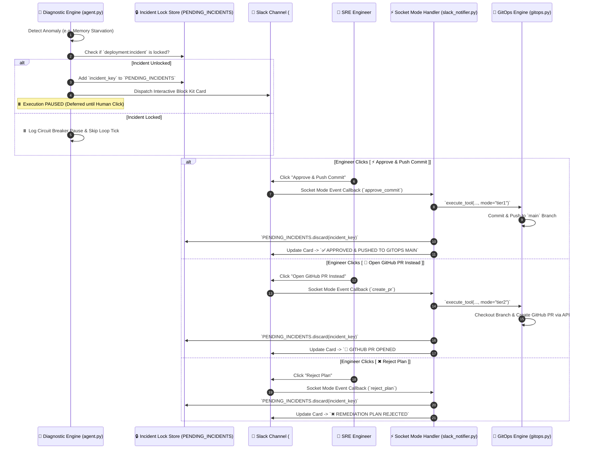

# 💬 Slack Interactive UX & Human-in-the-Loop Gateway

**Aegis-Observe** presents its findings and proposed remediations in Slack using **Slack Block Kit** interactive cards powered by **Slack Socket Mode**. This document explains the exact UX layout, state management, and Circuit-Breaker locking mechanism.

---

## 🎨 Interactive Block Kit UX Card

When an anomaly is detected, the agent dispatches a structured Slack card:

```text
🚨 [CRITICAL ALERT] Memory Starvation Detected
Target Workload: fraud-detection-api (oppe2-app namespace)

🧠 AI Diagnostic Reasoning:
PromQL telemetry indicates container memory utilization climbed from 958MB to 1.07GB over the last 5 minutes. The pod is nearing its 1Gi hard limit and is at imminent risk of an OOMKilled crash loop.

🛠️ Proposed Remediation Plan (patch_pod_limits):
CPU: 1000m ➔ 2000m
MEMORY: 1Gi ➔ 2Gi

📊 View Live SigNoz Metrics | 🔎 View OTel Trace Details

Action Required: Do you approve this declarative manifest patch?

[ ⚡ Approve & Push Commit ]   [ 📝 Open GitHub PR Instead ]   [ ✖ Reject Plan ]
```

---

## 🔄 Interaction Sequence Diagram



---

## 🔒 Circuit-Breaker Incident Locking Mechanism

To prevent race conditions where the 10-second diagnostic loop re-evaluates an active anomaly while an alert card is waiting in Slack:

1. **State Store**: `agent.PENDING_INCIDENTS = set()`
2. **Key Format**: `"{target_pod}:{incident_type}"` (e.g. `fraud-detection-api:Memory Starvation Detected`)
3. **Behavior**:
   - As soon as a proposal card is sent, `PENDING_INCIDENTS.add(incident_key)` locks the incident.
   - On subsequent loop iterations, if `incident_key in PENDING_INCIDENTS`, the engine logs:
     `"⏸️ [CIRCUIT BREAKER] Incident 'fraud-detection-api:Memory Starvation Detected' is awaiting human decision in Slack. Skipping loop iteration."`
   - When an engineer clicks any button (`Approve`, `PR`, or `Reject`), Socket Mode receives the event, processes the action, and executes `PENDING_INCIDENTS.discard(incident_key)`, unlocking the loop!

---

## 🖼️ Live Slack Interactive UX Screenshots

| Interactive Slack Proposal Card | Slack Card Updated After User Click |
| :---: | :---: |
|  |  |

---

## 🔗 Related Documentation
- [README.md](../README.md) — Main Project Overview & Quickstart
- [ARCHITECTURE.md](ARCHITECTURE.md) — System Architecture & Telemetry Pipeline
- [GITOPS_AND_REMEDIATION.md](GITOPS_AND_REMEDIATION.md) — GitOps Tiering & Remediation Engine
- [DASHBOARDS_AND_OBSERVABILITY.md](DASHBOARDS_AND_OBSERVABILITY.md) — SigNoz Dashboards Guide
